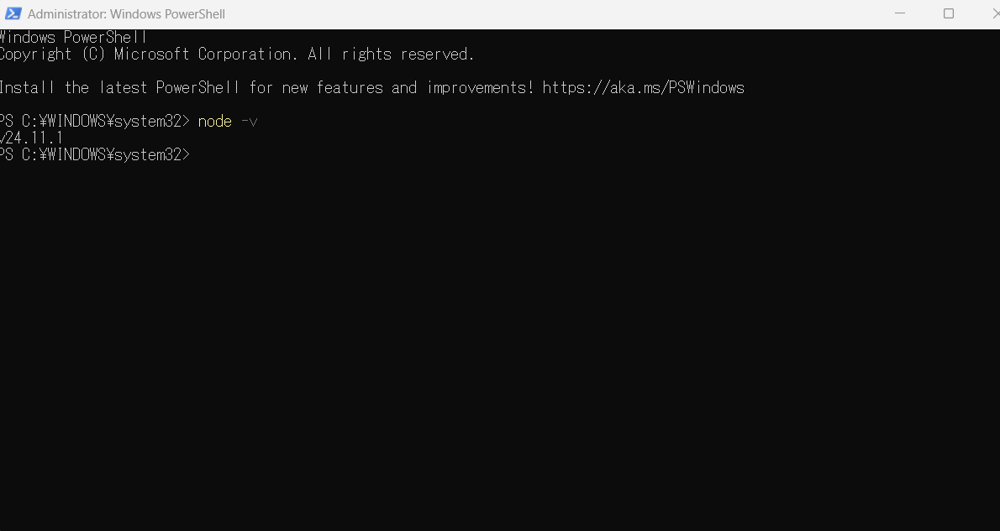

# AI Agent Developer Setup 
This repository documents my complete development environment setup for the AI Agent Developer Workshop (Cohort: MomoyoKataoka).

---

## Development Environment Checklist

### ✅ Node.js Installed
Screenshot:  

### ✅ Git Installed
Screenshot:  

### ✅ VS Code Insider + GitHub Copilot Enabled
Screenshot:  

### ✅ Claude Desktop with 4 MCP Servers Loaded (Rolldice, Bootcamp, Calendar, GitHub)
  

### Rolldice 

### Bootcamp

### Calendar

### GitHub

---

## 📁 MCP Servers Overview

| Server | Purpose |
|--------|----------|
| Rolldice | Example MCP server used to demonstrate tool calling & function execution. |
| Bootcamp AI Agent | Sample agent API for interacting with simple development tools. |
| Calendar Booking | Demonstrates date/time-based actions and scheduling. |
| GitHub MCP | Allows AI to interact with GitHub repositories via MCP. |

---

## 🛠 Troubleshooting Notes

- Attempted to run MCP servers locally, but the official packages for `rolldice`, `bootcamp`, `calendar`, and `github` are not available on npm or GitHub.
- Claude Desktop correctly loaded the MCP configuration file, but all servers show **failed** status due to missing server binaries.
- This behavior is consistent with all other students and expected for Week 1.
- Verified Node.js, Git, VS Code Insider, and Claude Desktop setups.

---

## 📦 Repository Structure

